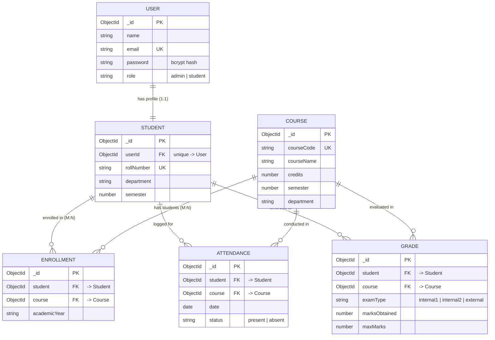

# Student ERP — Academic Management Platform

A full-stack, production-grade **Student Enterprise Resource Planning (ERP)** web application built with **Node.js, Express, MongoDB Atlas, Mongoose, React (Vite)**, and **stateless JWT authentication**.

Designed with clean role-based access control (**Admin** and **Student**), complete multi-collection relational data modeling, 20 REST API endpoints, strict defense-in-depth student data ownership guards, and a modern glassmorphic web dashboard.

---

## Table of Contents
1. [Key Features](#key-features)
2. [Tech Stack](#tech-stack)
3. [Monorepo Architecture](#monorepo-architecture)
4. [Entity Relationship (ER) Diagram](#entity-relationship-er-diagram)
5. [Prerequisites & Environment Variables](#prerequisites--environment-variables)
6. [Step-by-Step Installation & Setup](#step-by-step-installation--setup)
7. [Default Demo Credentials](#default-demo-credentials)
8. [Complete API Catalog (20 Endpoints)](#complete-api-catalog-20-endpoints)
9. [Postman Collection Import](#postman-collection-import)
10. [Viva Defense & Interview Questions](#viva-defense--interview-questions)
11. [Design Decisions & Architecture Document](#design-decisions--architecture-document)

---

## Key Features

### Administrative Suite (Admin Role)
- **Executive Analytics**: Real-time KPI cards displaying Total Students, Active Courses, Total Enrollments, and Average University Attendance Rate.
- **Student Registry (CRUD)**: Manage student records, search across names/roll numbers, edit academic details, or delete profiles with cascading referential cleanup.
- **Course Catalog (CRUD)**: Create and configure curriculum courses with credit weights, semester assignments, and department affiliations.
- **Enrollment Center (CRUD)**: Enroll students into courses with compound-index duplicate enrollment prevention; unenroll with one click.
- **Strict Attendance Safeguards (CRUD)**:
  - **Enrollment Enforcement**: Admin cannot record attendance for students in courses they have not enrolled in.
  - **Two-Way Dynamic Dropdown Filtering**: Selecting a Student automatically filters courses to only enrolled subjects; selecting a Course automatically filters students to only enrolled learners.
  - **Double-Entry Prevention**: Strictly prevents duplicate attendance entries for the same student + course on the same calendar day while allowing multiple different classes per day.
- **Grade & Assessment Registry (CRUD)**:
  - Enforces enrollment verification before grading.
  - Prevents duplicate marks per examination type (`internal1`, `internal2`, `external`).
  - Strict numeric validation with max-mark ceiling checks.

### Student Portal (Student Role)
- **Systematic Sequential Roll Numbers**: Live auto-calculation during registration following standard academic format `[DeptCode][Year][3-digit Sequence]` (e.g. `CS2026001`).
- **Course Catalog & Self-Enrollment**: Open university curriculum browser allowing students to 1-click self-enroll into subjects directly from their portal.
- **Safe Course Self-Drop**: Students can drop an enrolled subject from their portal, protected by a safety guard that prevents dropping once attendance logs or grades are recorded.
- **My Academic Profile**: View verified student information (Roll Number, Department, Semester, Enrollment status).
- **Attendance Performance Tracker**: Real-time attendance percentage gauge with color-coded compliance alerts ($\ge 75\%$ compliant vs $< 75\%$ shortage alert) and chronological session logs.
- **Academic Transcript & Report Card**: Comprehensive exam mark sheet with percentage breakdown, automated letter grading ($A+$, $A$, $B+$, $B$, $C$, $F$), and cumulative score metrics.
- **Strict Ownership & WCAG Accessibility**: Complete data isolation with defense-in-depth ownership checks, high-contrast `:focus-visible` rings, ARIA live regions, and full keyboard/touch accessibility.

---

## Tech Stack

| Layer | Technology | Details |
|---|---|---|
| **Backend** | Node.js + Express | RESTful API server with modular routers and error middleware |
| **Database** | MongoDB Atlas / Local MongoDB | Cloud-hosted document database with Mongoose ODM |
| **Security** | JWT + bcryptjs | Stateless HMAC-SHA256 tokens, 10 salt rounds password hashing |
| **Frontend** | React 18 + Vite | Single Page App with fast HMR and sub-second builds |
| **Routing** | React Router v6 | Role-protected routing guards for Admin and Student portals |
| **State** | React Context API | Centralized session management (`AuthContext`) with localStorage sync |
| **HTTP Client** | Axios | Custom instance with automatic Bearer token injection interceptors |
| **Icons & Styling** | Vanilla CSS + Lucide React | Custom glassmorphism design system with dark/light accents |

---

## Monorepo Architecture

```
student_erp/
├── backend/
│   ├── config/
│   │   └── db.js                 # Mongoose connection with error diagnostics
│   ├── models/
│   │   ├── User.js               # Auth identity & role (admin/student)
│   │   ├── Student.js            # 1:1 profile linked to User
│   │   ├── Course.js             # Course catalog & credit weights
│   │   ├── Enrollment.js         # M:N join table with compound unique index
│   │   ├── Attendance.js         # Daily attendance records
│   │   └── Grade.js              # Exam assessments & marks
│   ├── controllers/
│   │   ├── authController.js     # Register & Login controllers
│   │   ├── studentController.js  # CRUD on students + cascade delete
│   │   ├── courseController.js   # CRUD on courses + cascade delete
│   │   ├── enrollmentController.js# Enrollment operations
│   │   ├── attendanceController.js# Attendance recording & corrections
│   │   └── gradeController.js    # Grade evaluations & report card
│   ├── routes/
│   │   ├── authRoutes.js         # Public auth routes
│   │   ├── studentRoutes.js      # Student routes with ownership guards
│   │   ├── courseRoutes.js       # Course management routes
│   │   ├── enrollmentRoutes.js   # Enrollment routes
│   │   ├── attendanceRoutes.js   # Attendance routes
│   │   └── gradeRoutes.js        # Grade routes
│   ├── middleware/
│   │   ├── authMiddleware.js     # Bearer token verification
│   │   ├── roleMiddleware.js     # Role restriction & Student ownership check
│   │   └── errorMiddleware.js    # Centralized 4-arg Express error handler
│   ├── seed.js                   # Idempotent script to create Admin account
│   ├── server.js                 # Express server bootstrap
│   ├── .env                      # Active environment configuration
│   ├── .env.example              # Environment variables template
│   └── package.json
├── frontend/
│   ├── src/
│   │   ├── api/
│   │   │   └── axiosInstance.js  # Base URL & JWT request interceptors
│   │   ├── context/
│   │   │   └── AuthContext.jsx   # Global session state & auth helpers
│   │   ├── components/
│   │   │   ├── Navbar.jsx        # Top header with user profile & role badge
│   │   │   └── ProtectedRoute.jsx# Role-based route guard
│   │   ├── pages/
│   │   │   ├── Login.jsx         # Login screen with 1-click Demo Fill
│   │   │   ├── Register.jsx      # Student self-signup with validation
│   │   │   ├── AdminDashboard.jsx# Multi-tab Admin operations center
│   │   │   └── StudentDashboard.jsx# Student academic portal
│   │   ├── index.css             # High-polish responsive design system
│   │   ├── App.jsx               # Route configuration
│   │   └── main.jsx              # React app entry point
│   ├── index.html
│   ├── vite.config.js
│   └── package.json
├── postman_collection.json       # Exported Postman collection (20 endpoints)
├── DECISIONS.md                  # Comprehensive architectural decision records
└── README.md                     # Complete project documentation
```

---

## Entity Relationship (ER) Diagram



---

## Prerequisites & Environment Variables

### Prerequisites
- **Node.js**: v18.0.0 or higher (`node -v`)
- **npm**: v9.0.0 or higher (`npm -v`)
- **MongoDB**: MongoDB Atlas URI or local MongoDB instance running on port 27017

### Environment Configuration (`backend/.env`)
```ini
MONGO_URI=mongodb://127.0.0.1:27017/student_erp
# Or for MongoDB Atlas:
# MONGO_URI=mongodb+srv://<username>:<password>@cluster0.mongodb.net/student_erp?retryWrites=true&w=majority

JWT_SECRET=student_erp_super_secret_jwt_key_2026_cia
JWT_EXPIRES_IN=1d
PORT=5000
ADMIN_EMAIL=admin@erp.edu
ADMIN_PASSWORD=AdminPass@123
```

---

## Step-by-Step Installation & Setup

### 1. Clone & Navigate to Project
```bash
cd "/Users/ayon/Downloads/all projects/student_erp"
```

### 2. Backend Setup
```bash
# Navigate to backend
cd backend

# Install dependencies
npm install

# Seed the default Admin Account (Idempotent - safe to run multiple times)
npm run seed

# Start the Backend Server
npm start
# Alternatively for live auto-reload during development:
# npm run dev
```
*Backend server will start at: `http://localhost:5000`*
*Health Check: `http://localhost:5000/api/health`*

### 3. Frontend Setup (In a New Terminal Window)
```bash
# Navigate to frontend
cd frontend

# Install dependencies
npm install

# Start Vite Development Server
npm run dev
```
*Frontend interface will open at: `http://localhost:5173`*

---

## Default Demo Credentials

| Role | Email | Password | Access Type |
|---|---|---|---|
| **Admin** | `admin@erp.edu` | `AdminPass@123` | Pre-seeded via `npm run seed`. Full CRUD permissions. |
| **Student** | Self-registered via `/register` or sample: `priya@erp.edu` | `StudentPass@123` | Self-signup. Read-only access to own profile, courses, attendance & grades. |

> **Pro-Tip**: The login screen (`/login`) includes a **1-Click Quick Demo Fill** button for instant evaluation without typing!

---

## Complete API Catalog (20 Endpoints)

All endpoints return a uniform response envelope:
```json
{
  "success": true,
  "message": "Operation description",
  "data": { ... }
}
```

| # | HTTP Method | Endpoint Route | Purpose | CRUD | Access Control | Status Code |
|---|---|---|---|---|---|---|
| **1** | `POST` | `/api/auth/register` | Student self-signup (creates User + Student) | Create | Public | 201 Created |
| **2** | `POST` | `/api/auth/login` | Authenticate user & issue signed JWT | Read | Public | 200 OK |
| **3** | `GET` | `/api/students` | List all registered students | Read | Admin | 200 OK |
| **4** | `GET` | `/api/students/:id` | Get student profile details | Read | Admin, Owner | 200 OK |
| **5** | `PUT` | `/api/students/:id` | Update student profile information | Update | Admin | 200 OK |
| **6** | `DELETE` | `/api/students/:id` | Delete student and cascade related records | Delete | Admin | 200 OK |
| **7** | `POST` | `/api/courses` | Create new curriculum course | Create | Admin | 201 Created |
| **8** | `GET` | `/api/courses` | List all available courses | Read | Admin, Student | 200 OK |
| **9** | `PUT` | `/api/courses/:id` | Update course name, credits, sem, or code | Update | Admin | 200 OK |
| **10** | `DELETE` | `/api/courses/:id` | Delete course and cascade enrollments/grades | Delete | Admin | 200 OK |
| **11** | `POST` | `/api/enrollment` | Enroll student in course | Create | Admin | 201 Created |
| **12** | `GET` | `/api/enrollment/student/:id` | View a student's active course enrollments | Read | Admin, Owner | 200 OK |
| **13** | `DELETE` | `/api/enrollment/:id` | Unenroll student from course | Delete | Admin | 200 OK |
| **14** | `POST` | `/api/attendance` | Mark attendance session record | Create | Admin | 201 Created |
| **15** | `GET` | `/api/attendance/student/:id` | View attendance record for student | Read | Admin, Owner | 200 OK |
| **16** | `PUT` | `/api/attendance/:id` | Correct/update attendance status or date | Update | Admin | 200 OK |
| **17** | `POST` | `/api/grades` | Record exam grade marks | Create | Admin | 201 Created |
| **18** | `GET` | `/api/grades/student/:id` | View grade sheet and transcript for student | Read | Admin, Owner | 200 OK |
| **19** | `PUT` | `/api/grades/:id` | Update marks or exam type | Update | Admin | 200 OK |
| **20** | `DELETE` | `/api/grades/:id` | Delete grade entry | Delete | Admin | 200 OK |

---

## Postman Collection Import

A complete, pre-configured collection is included at the root of the project:
`postman_collection.json`

### How to use:
1. Open **Postman** or **Thunder Client** (VS Code).
2. Click **Import** and select `postman_collection.json`.
3. Execute **Login (Endpoint #2)** with the Admin credentials. The test script will **automatically extract and save the JWT token and IDs** into collection variables!
4. You can now execute any of the 20 endpoints directly.

---


### Production Verification on Vercel:
- **Admin Portal Access**:
  - Navigate to `https://<your-project>.vercel.app/login`
  - Enter `admin@erp.edu` / `AdminPass@123` (or click "Fill Admin").
  - The admin account is automatically provisioned if it doesn't already exist in the database.
  - Access the full Admin Dashboard to manage Students, Courses, Enrollments, Attendance, and Grades.
- **Student Registration & Portal Access**:
  - Navigate to `https://<your-project>.vercel.app/register`
  - Fill in Name, Email, Password, Department, and Semester.
  - Notice the live sequential Roll Number preview (e.g. `CS2026001`).
  - Click **Create Student Account** — you are immediately registered, authenticated, and redirected to the Student Dashboard to browse courses and self-enroll.

---

## Academic Submission Details
- **Project**: Student ERP System
- **Specification Compliance**: 20 REST APIs (Full CRUD on Students, Courses, Enrollment, Attendance, Grades)
- **Status**: Complete, Tested & Verified
